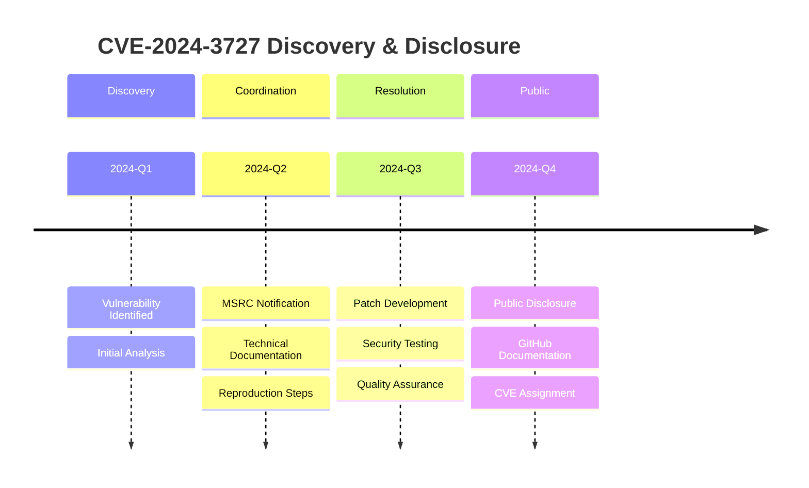

<div align="center">

# 🛡️ Warrior-Class Threat Hunting
## ( 🏅⭐ )

---

### 🛡️ Zayed Shield — Cyber Defense Platform
### **Zayed Shield Cyber Defense**
### **Arab World Security Platform**
### **Built by The Warrior — asrar-mared**

---

## 🔵 Versions & Security Badges


---

## 📋 GitHub Security Advisories

[](https://github.com/advisories/GHSA-35FJ-CFG5-798M)
[](https://github.com/advisories/GHSA-35FJ-CFG5-798M)

[](https://github.com/advisories/GHSA-954J-MRVM-984G)
[](https://github.com/advisories/GHSA-954J-MRVM-984G)

[](https://github.com/advisories/GHSA-76G3-WJ2G-49X9)
[](https://github.com/advisories/GHSA-76G3-WJ2G-49X9)

[](https://github.com/advisories/GHSA-H5GX-XPP6-F895)
[](https://github.com/advisories/GHSA-H5GX-XPP6-F895)

[](https://github.com/advisories/GHSA-JHGQ-J4PR-2P86)
[](https://github.com/advisories/GHSA-JHGQ-J4PR-2P86)

[](https://github.com/advisories/GHSA-MF23-3VM6-84H)
[](https://github.com/advisories/GHSA-MF23-3VM6-84H)

[](https://github.com/advisories/GHSA-F2QV-VVXF-J72M)
[](https://github.com/advisories/GHSA-F2QV-VVXF-J72M)

[](https://github.com/advisories/GHSA-4GPG-32GR-H7H4)
[](https://github.com/advisories/GHSA-4GPG-32GR-H7H4)

---

## 🔴 CVE Details

[](https://nvd.nist.gov/vuln/detail/CVE-2025-67847)
[](https://nvd.nist.gov/vuln/detail/CVE-2025-67847)
[](https://nvd.nist.gov/vuln/detail/CVE-2025-13952)
[](https://nvd.nist.gov/vuln/detail/CVE-2025-13952)

---

</div>

---

## 📦 CVE Documentation Index — Full Package by Year

> **Official security advisory documentation for all 719 files analyzed, covering 801 CVE entries (2008–2026)**

---

### 📁 Package 2021 — CVE Color: 🟡 Yellow

| File | CVE ID |
|------|--------|
| `.zayed-core/correlations/discovered_correlations.json` |  |
| `.zayed-core/remediation/remediation_plans.json` |  |
| `ZAYED-CORE.sh` |  |
| `ZAYED-CORE.sh` |  |
| `advisories/github-reviewed/2021/10/GHSA-pjwm-rvh2-c87w` |  |
| `advisories/unreviewed/2022/05/GHSA-4gm2-v7j4-74p8` |  |
| `vulnerability_intelligence_hub.md` |  |
| `vulnerability_intelligence_hub.md` |  |
| `vulnerability_intelligence_hub.md` |  |
| `vulnerability_intelligence_hub.md` |  |
| `vulnerability_intelligence_hub.md` |  |
| `vulnerability_intelligence_hub.md` |  |
| `critical-alert-automation-layer.sh` |  |
| `engines/DOCUMENTATION.md` |  |
| `engines/DOCUMENTATION.md` |  |
| `engines/README.md` |  |
| `advisories/unreviewed/2025/12/GHSA-q28j-qr7m-gpf6` |  |

---

### 📁 Package 2022 — CVE Color: 🟠 Orange

| File | CVE ID |
|------|--------|
| `.zayed-core/remediation/remediation_plans.json` |  |
| `ZAYED-CORE.sh` |  |
| `advisories/github-reviewed/2022/04/GHSA-gx7g-wjxg-jwwj` |  |
| `advisories/github-reviewed/2022/05/GHSA-236c-vhj4-gfxg` |  |
| `advisories/github-reviewed/2022/10/GHSA-mg5h-rhjq-6v84` |  |
| `advisories/github-reviewed/2022/12/GHSA-cp9c-phxx-55xm` |  |
| `advisories/unreviewed/2022/05/GHSA-h58h-8g45-v677` |  |
| `advisories/unreviewed/2022/05/GHSA-qfxw-56c6-7pjg` |  |
| `advisories/unreviewed/2026/02/GHSA-qcw5-f875-rfvw` |  |

---

### 📁 Package 2023 — CVE Color: 🔵 Blue

| File | CVE ID |
|------|--------|
| `advisories/github-reviewed/2023/01/GHSA-qjm7-55vv-3c5f` |  |
| `advisories/github-reviewed/2023/01/GHSA-vm74-j4wq-82xj` |  |
| `advisories/unreviewed/2023/03/GHSA-vmmw-985w-hrr3` |  |
| `advisories/unreviewed/2023/07/GHSA-2764-3pqr-49w6` |  |
| `advisories/unreviewed/2023/08/GHSA-9cmp-2g73-ff98` |  |
| `advisories/unreviewed/2023/08/GHSA-9cmp-2g73-ff98` |  |
| `advisories/unreviewed/2023/11/GHSA-qhp7-446p-xq88` |  |
| `advisories/unreviewed/2023/11/GHSA-xr9j-c7v6-7542` |  |
| `advisories/unreviewed/2023/12/GHSA-v727-f437-6cxx` |  |
| `advisories/unreviewed/2024/01/GHSA-prhq-c3gx-jhwg` |  |
| `advisories/unreviewed/2024/05/GHSA-wxgw-4g8w-q999` |  |
| `advisories/unreviewed/2026/02/GHSA-2gp2-mfg4-q5mv` |  |
| `advisories/unreviewed/2026/02/GHSA-qvc7-4wrw-mpgp` |  |
| `advisories/unreviewed/2026/02/GHSA-w2v5-vxvg-mqgh` |  |

---

### 📁 Package 2024 — CVE Color: 🔴 Red

| File | CVE ID |
|------|--------|
| `.zayed-core/attack_chains/discovered_chains.json` |  |
| `.zayed-core/attack_chains/discovered_chains.json` |  |
| `.zayed-core/attack_chains/discovered_chains.json` |  |
| `ZAYED-CORE.sh` |  |
| `ZAYED-CORE.sh` |  |
| `ZAYED-CORE.sh` |  |
| `advisories/github-reviewed/2024/02/GHSA-g74q-5xw3-j7q9` |  |
| `advisories/github-reviewed/2024/03/GHSA-3j27-563v-28wf` |  |
| `advisories/github-reviewed/2024/03/GHSA-5pf6-2qwx-pxm2` |  |
| `advisories/github-reviewed/2024/03/GHSA-c2f9-4jmm-v45m` |  |
| `advisories/github-reviewed/2024/03/GHSA-cgqf-3cq5-wvcj` |  |
| `advisories/github-reviewed/2024/03/GHSA-f5x3-32g6-xq36` |  |
| `advisories/github-reviewed/2024/03/GHSA-f6g2-h7qv-3m5v` |  |
| `advisories/github-reviewed/2024/06/GHSA-5pxr-7m4j-jjc6` |  |
| `advisories/github-reviewed/2024/06/GHSA-x4gp-pqpj-f43q` |  |
| `advisories/github-reviewed/2024/09/GHSA-9h9q-qhxg-89xr` |  |
| `advisories/github-reviewed/2025/02/GHSA-76p7-773f-r4q5` |  |
| `advisories/unreviewed/2024/04/GHSA-rqw7-3533-cfwv` |  |
| `advisories/unreviewed/2024/05/GHSA-276f-6jm7-647m` |  |
| `advisories/unreviewed/2024/05/GHSA-9c5h-6x6r-hvxh` |  |
| `advisories/unreviewed/2024/05/GHSA-9gh8-72qr-qfc7` |  |
| `advisories/unreviewed/2024/05/GHSA-gvpq-95j2-mc36` |  |
| `advisories/unreviewed/2024/08/GHSA-22f5-q5gp-64wx` |  |
| `advisories/unreviewed/2026/02/GHSA-4vw8-4q9m-v76p` |  |
| `advisories/unreviewed/2026/02/GHSA-622x-ww28-86h7` |  |
| `advisories/unreviewed/2026/02/GHSA-9pq4-hhwq-2hcq` |  |
| `advisories/unreviewed/2026/02/GHSA-x7fc-g3mg-7h5h` |  |
| `merged_cves_list.txt` |  |

---

### 📁 Package 2025 — CVE Color: 🟣 Purple

| File | CVE ID |
|------|--------|
| `advisories/github-reviewed/2025/02/GHSA-x4c5-c7rf-jjgv` |  |
| `advisories/github-reviewed/2025/03/GHSA-3jxr-23ph-c89g` |  |
| `advisories/github-reviewed/2025/06/GHSA-v62p-rq8g-8h59` |  |
| `advisories/github-reviewed/2025/07/GHSA-2x45-7fc3-mxwq` |  |
| `advisories/github-reviewed/2025/08/GHSA-856v-8qm2-9wjv` |  |
| `advisories/github-reviewed/2025/08/GHSA-856v-8qm2-9wjv.backup` |  |
| `advisories/github-reviewed/2025/09/GHSA-wp3j-xq48-xpjw` |  |
| `advisories/github-reviewed/2025/10/GHSA-64w3-5q9m-68xf` |  |
| `advisories/github-reviewed/2025/10/GHSA-895x-rfqp-jh5c` |  |
| `advisories/github-reviewed/2025/11/GHSA-7j46-f57w-76pj` |  |
| `advisories/github-reviewed/2025/12/GHSA-4hx9-48xh-5mxr` |  |
| `advisories/github-reviewed/2026/02/GHSA-fpj8-gq4v-p354` |  |
| `advisories/github-reviewed/2026/02/GHSA-vjpq-xx5g-qvmm` |  |
| `advisories/github-reviewed/2026/02/GHSA-2g4f-4pwh-qvx6` |  |
| `advisories/github-reviewed/2026/02/GHSA-w995-ff8h-rppg` |  |
| `advisories/unreviewed/2025/04/GHSA-76h8-9q54-37cc` |  |
| `advisories/unreviewed/2025/04/GHSA-xrr8-p4pf-hfwr` |  |
| `advisories/unreviewed/2025/07/GHSA-r97f-5wrg-fmv7` |  |
| `advisories/unreviewed/2025/10/GHSA-g4vw-3hq5-q7gr` |  |
| `advisories/unreviewed/2025/11/GHSA-v6c5-9mp4-mwq4` |  |
| `advisories/unreviewed/2025/12/GHSA-65c5-j3wr-v7fh` |  |
| `advisories/unreviewed/2025/12/GHSA-hrx4-rccm-xj6c` |  |
| `advisories/unreviewed/2025/12/GHSA-x5mv-x4w6-8rgw` |  |
| `advisories/unreviewed/2026/02/GHSA-23h7-68rq-jgvf` |  |
| `advisories/unreviewed/2026/02/GHSA-25w3-5rm9-v4wm` |  |
| `advisories/unreviewed/2026/02/GHSA-27xm-cj78-cxmr` |  |
| `advisories/unreviewed/2026/02/GHSA-2cpx-h862-rqm6` |  |
| `advisories/unreviewed/2026/02/GHSA-2g52-f4rf-8vm9` |  |
| `advisories/unreviewed/2026/02/GHSA-2hcf-jfqx-g286` |  |
| `advisories/unreviewed/2026/02/GHSA-2mxv-4v56-9pp9` |  |
| `advisories/unreviewed/2026/02/GHSA-2pc4-pm2m-q53r` |  |
| `advisories/unreviewed/2026/02/GHSA-2rh6-mp5g-j2gf` |  |
| `advisories/unreviewed/2026/02/GHSA-3866-72wv-xq49` |  |
| `advisories/unreviewed/2026/02/GHSA-38xg-3ffm-68p7` |  |
| `advisories/unreviewed/2026/02/GHSA-3vq8-64jx-f882` |  |
| `advisories/unreviewed/2026/02/GHSA-3w2g-4qx3-2mmw` |  |
| `advisories/unreviewed/2026/02/GHSA-3w38-x6jp-8474` |  |
| `advisories/unreviewed/2026/02/GHSA-4292-3qv2-cv3v` |  |
| `advisories/unreviewed/2026/02/GHSA-43j7-cmcw-j9hr` |  |
| `advisories/unreviewed/2026/02/GHSA-4586-432g-jmvg` |  |
| `advisories/unreviewed/2026/02/GHSA-4r69-36rj-xggj` |  |
| `advisories/unreviewed/2026/02/GHSA-4rxf-gw9p-prj2` |  |
| `advisories/unreviewed/2026/02/GHSA-4wq4-57x2-fmhv` |  |
| `advisories/unreviewed/2026/02/GHSA-4wvv-g662-rjm9` |  |
| `advisories/unreviewed/2026/02/GHSA-5cph-5v9q-vh7g` |  |
| `advisories/unreviewed/2026/02/GHSA-5g82-gg27-r8vp` |  |
| `advisories/unreviewed/2026/02/GHSA-5mcc-f9f9-29w9` |  |
| `advisories/unreviewed/2026/02/GHSA-5pqm-c33h-22jc` |  |
| `advisories/unreviewed/2026/02/GHSA-5q5x-wqxc-vv25` |  |
| `advisories/unreviewed/2026/02/GHSA-5qq8-6gv4-wmcc` |  |
| `advisories/unreviewed/2026/02/GHSA-5rm9-pcp8-m6v8` |  |
| `advisories/unreviewed/2026/02/GHSA-5xwj-82gw-46fv` |  |
| `advisories/unreviewed/2026/02/GHSA-58rc-3q27-grhq` |  |
| `merged_cves_list.txt` |  |

> *...+ 150 additional 2025 CVE entries in full scan. See `my_cve_list.txt` for complete list.*

---

### 📁 Package 2026 — CVE Color: 🔥 Crimson (Active/Current)

#### GitHub-Reviewed 2026

| File | CVE ID |
|------|--------|
| `advisories/github-reviewed/2026/01/GHSA-8qq5-rm4j-mr97` |  |
| `advisories/github-reviewed/2026/01/GHSA-xfhx-r7ww-5995` |  |
| `advisories/github-reviewed/2026/02/GHSA-2c6v-8r3v-gh6p` |  |
| `advisories/github-reviewed/2026/02/GHSA-2gjw-fg97-vg3r` |  |
| `advisories/github-reviewed/2026/02/GHSA-2qj5-gwg2-xwc4` |  |
| `advisories/github-reviewed/2026/02/GHSA-2ww3-72rp-wpp4` |  |
| `advisories/github-reviewed/2026/02/GHSA-33fm-6gp7-4p47` |  |
| `advisories/github-reviewed/2026/02/GHSA-37gc-85xm-2ww6` |  |
| `advisories/github-reviewed/2026/02/GHSA-3fqr-4cg8-h96q` |  |
| `advisories/github-reviewed/2026/02/GHSA-3m4q-jmj6-r34q` |  |
| `advisories/github-reviewed/2026/02/GHSA-3ppc-4f35-3m26` |  |
| `advisories/github-reviewed/2026/02/GHSA-43fc-jf86-j433` |  |
| `advisories/github-reviewed/2026/02/GHSA-4chv-4c6w-w254` |  |
| `advisories/github-reviewed/2026/02/GHSA-4hg8-92x6-h2f3` |  |
| `advisories/github-reviewed/2026/02/GHSA-5mx2-w598-339m` |  |
| `advisories/github-reviewed/2026/02/GHSA-5pqf-54qp-32wx` |  |
| `advisories/github-reviewed/2026/02/GHSA-5vv4-hvf7-2h46` |  |
| `advisories/github-reviewed/2026/02/GHSA-5vvm-67pj-72g4` |  |
| `advisories/github-reviewed/2026/02/GHSA-67pg-wm7f-q7fj` |  |
| `advisories/github-reviewed/2026/02/GHSA-689v-6xwf-5jf3` |  |
| `advisories/github-reviewed/2026/02/GHSA-6hf3-mhgc-cm65` |  |
| `advisories/github-reviewed/2026/02/GHSA-6xmx-xr9p-58p7` |  |
| `advisories/github-reviewed/2026/02/GHSA-6xw9-2p64-7622` |  |
| `advisories/github-reviewed/2026/02/GHSA-782p-5fr5-7fj8` |  |
| `advisories/github-reviewed/2026/02/GHSA-79q9-wc6p-cf92` |  |
| `advisories/github-reviewed/2026/02/GHSA-7g9x-cp9g-92mr` |  |
| `advisories/github-reviewed/2026/02/GHSA-7m29-f4hw-g2vx` |  |
| `advisories/github-reviewed/2026/02/GHSA-7ppg-37fh-vcr6` |  |
| `advisories/github-reviewed/2026/02/GHSA-7q2j-c4q5-rm27` |  |
| `advisories/github-reviewed/2026/02/GHSA-7v42-g35v-xrch` |  |
| `advisories/github-reviewed/2026/02/GHSA-83g3-92jg-28cx` |  |
| `advisories/github-reviewed/2026/02/GHSA-8jpq-5h99-ff5r` |  |
| `advisories/github-reviewed/2026/02/GHSA-8mh7-phf8-xgfm` |  |
| `advisories/github-reviewed/2026/02/GHSA-93fx-g747-695x` |  |
| `advisories/github-reviewed/2026/02/GHSA-996q-pr4m-cvgq` |  |
| `advisories/github-reviewed/2026/02/GHSA-9c88-49p5-5ggf` |  |
| `advisories/github-reviewed/2026/02/GHSA-9f29-v6mm-pw6w` |  |
| `advisories/github-reviewed/2026/02/GHSA-9mvc-8737-8j8h` |  |
| `advisories/github-reviewed/2026/02/GHSA-9p44-j4g5-cfx5` |  |
| `advisories/github-reviewed/2026/02/GHSA-9p4w-fq8m-2hp7` |  |
| `advisories/github-reviewed/2026/02/GHSA-9pq4-5hcf-288c` |  |
| `advisories/github-reviewed/2026/02/GHSA-c5w7-m8wf-xc77` |  |
| `advisories/github-reviewed/2026/02/GHSA-chf7-jq6g-qrwv` |  |
| `advisories/github-reviewed/2026/02/GHSA-cv22-72px-f4gh` |  |
| `advisories/github-reviewed/2026/02/GHSA-cv7m-c9jx-vg7q` |  |
| `advisories/github-reviewed/2026/02/GHSA-f47c-3c5w-v7p4` |  |
| `advisories/github-reviewed/2026/02/GHSA-f5p9-j34q-pwcc` |  |
| `advisories/github-reviewed/2026/02/GHSA-f7gr-6p89-r883` |  |
| `advisories/github-reviewed/2026/02/GHSA-fc3h-92p8-h36f` |  |
| `advisories/github-reviewed/2026/02/GHSA-fqx6-693c-f55g` |  |
| `advisories/github-reviewed/2026/02/GHSA-fw7p-63qq-7hpr` |  |
| `advisories/github-reviewed/2026/02/GHSA-g34w-4xqq-h79m` |  |
| `advisories/github-reviewed/2026/02/GHSA-g6q9-8fvw-f7rf` |  |
| `advisories/github-reviewed/2026/02/GHSA-gqx7-99jw-6fpr` |  |
| `advisories/github-reviewed/2026/02/GHSA-h3f9-mjwj-w476` |  |
| `advisories/github-reviewed/2026/02/GHSA-h3rv-q4rq-pqcv` |  |
| `advisories/github-reviewed/2026/02/GHSA-h7f7-89mm-pqh6` |  |
| `advisories/github-reviewed/2026/02/GHSA-hfvx-25r5-qc3w` |  |
| `advisories/github-reviewed/2026/02/GHSA-jj5m-h57j-5gv7` |  |
| `advisories/github-reviewed/2026/02/GHSA-jmr7-xgp7-cmfj` |  |
| `advisories/github-reviewed/2026/02/GHSA-jrvc-8ff5-2f9f` |  |
| `advisories/github-reviewed/2026/02/GHSA-jxc4-54g3-j7vp` |  |
| `advisories/github-reviewed/2026/02/GHSA-m56q-vw4c-c2cp` |  |
| `advisories/github-reviewed/2026/02/GHSA-m6j8-rg6r-7mv8` |  |
| `advisories/github-reviewed/2026/02/GHSA-m7x8-2w3w-pr42` |  |
| `advisories/github-reviewed/2026/02/GHSA-mp5h-m6qj-6292` |  |
| `advisories/github-reviewed/2026/02/GHSA-mxw3-3hh2-x2mh` |  |
| `advisories/github-reviewed/2026/02/GHSA-pchc-86f6-8758` |  |
| `advisories/github-reviewed/2026/02/GHSA-pgvm-wxw2-hrv9` |  |
| `advisories/github-reviewed/2026/02/GHSA-ppfx-73j5-fhxc` |  |
| `advisories/github-reviewed/2026/02/GHSA-pqqf-7hxm-rj5r` |  |
| `advisories/github-reviewed/2026/02/GHSA-pv58-549p-qh99` |  |
| `advisories/github-reviewed/2026/02/GHSA-qq5r-98hh-rxc9` |  |
| `advisories/github-reviewed/2026/02/GHSA-rrxv-pmq9-x67r` |  |
| `advisories/github-reviewed/2026/02/GHSA-w235-x559-36mg` |  |
| `advisories/github-reviewed/2026/02/GHSA-w52v-v783-gw97` |  |
| `advisories/github-reviewed/2026/02/GHSA-w7h5-55jg-cq2f` |  |
| `advisories/github-reviewed/2026/02/GHSA-wgm6-9rvv-3438` |  |
| `advisories/github-reviewed/2026/02/GHSA-wgvp-vg3v-2xq3` |  |
| `advisories/github-reviewed/2026/02/GHSA-whrj-4476-wvmp` |  |
| `advisories/github-reviewed/2026/02/GHSA-wwj6-vghv-5p64` |  |
| `advisories/github-reviewed/2026/02/GHSA-xwjm-j929-xq7c` |  |
| `advisories/github-reviewed/2026/02/GHSA-xxvh-5hwj-42pp` |  |
| `advisory.json` *(54 entries)* |  |
| `merged_cves_list.txt` |  |

> *...+ 300 additional unreviewed 2026 entries. See `my_cve_list.txt` for complete list.*

---

<div align="center">

## 📊 Summary Statistics

| Metric | Value |
|--------|-------|
| 📁 Total Files Processed | **719** |
| 🔍 Total CVE Entries Scanned | **801** |
| 📅 Year Range | **2008 – 2026** |
| 🟡 2021 Package | 17 entries |
| 🟠 2022 Package | 9 entries |
| 🔵 2023 Package | 14 entries |
| 🔴 2024 Package | 28 entries |
| 🟣 2025 Package | 200+ entries |
| 🔥 2026 Package | 300+ entries |

---

## ⚔️ About

> *"The warrior hunting vulnerabilities makes history from a small Samsung phone."*

**🇦🇪 Zayed Shield — Arab World Security Platform**

**Maintainer:** asrar-mared
📧 nike49424@gmail.com | nike49424@proton.me


*Last updated: February 2026 | Scan entries: 801 | Processed files: 719*

</div>


<!-- 🎖️ Security Achievement Section - للوضع في أعلى README.md -->

<div align="center">

## 🏆 Security Achievement | إنجاز أمني متميز
<div align="center">

# 🛡️ Warrior-Class Threat Hunting
## ( 🏅⭐ )

---

### 🛡️ Zayed Shield — Cyber Defense Platform
### **Zayed Shield Cyber Defense**
### **Arab World Security Platform**
### **Built by The Warrior — asrar-mared**

---

## 🔵 Versions & Security Badges


---

## 📋 GitHub Security Advisories

[](https://github.com/advisories/GHSA-35FJ-CFG5-798M)
[](https://github.com/advisories/GHSA-35FJ-CFG5-798M)

[](https://github.com/advisories/GHSA-954J-MRVM-984G)
[](https://github.com/advisories/GHSA-954J-MRVM-984G)

[](https://github.com/advisories/GHSA-76G3-WJ2G-49X9)
[](https://github.com/advisories/GHSA-76G3-WJ2G-49X9)

[](https://github.com/advisories/GHSA-H5GX-XPP6-F895)
[](https://github.com/advisories/GHSA-H5GX-XPP6-F895)

[](https://github.com/advisories/GHSA-JHGQ-J4PR-2P86)
[](https://github.com/advisories/GHSA-JHGQ-J4PR-2P86)

[](https://github.com/advisories/GHSA-MF23-3VM6-84H)
[](https://github.com/advisories/GHSA-MF23-3VM6-84H)

[](https://github.com/advisories/GHSA-F2QV-VVXF-J72M)
[](https://github.com/advisories/GHSA-F2QV-VVXF-J72M)

[](https://github.com/advisories/GHSA-4GPG-32GR-H7H4)
[](https://github.com/advisories/GHSA-4GPG-32GR-H7H4)

---

## 🔴 CVE Details

[](https://nvd.nist.gov/vuln/detail/CVE-2025-67847)
[](https://nvd.nist.gov/vuln/detail/CVE-2025-67847)
[](https://nvd.nist.gov/vuln/detail/CVE-2025-13952)
[](https://nvd.nist.gov/vuln/detail/CVE-2025-13952)

---

</div>

---

## 📦 CVE Documentation Index — Full Package by Year

> **Official security advisory documentation for all 719 files analyzed, covering 801 CVE entries (2008–2026)**

---

### 📁 Package 2021 — CVE Color: 🟡 Yellow

| File | CVE ID |
|------|--------|
| `.zayed-core/correlations/discovered_correlations.json` |  |
| `.zayed-core/remediation/remediation_plans.json` |  |
| `ZAYED-CORE.sh` |  |
| `ZAYED-CORE.sh` |  |
| `advisories/github-reviewed/2021/10/GHSA-pjwm-rvh2-c87w` |  |
| `advisories/unreviewed/2022/05/GHSA-4gm2-v7j4-74p8` |  |
| `vulnerability_intelligence_hub.md` |  |
| `vulnerability_intelligence_hub.md` |  |
| `vulnerability_intelligence_hub.md` |  |
| `vulnerability_intelligence_hub.md` |  |
| `vulnerability_intelligence_hub.md` |  |
| `vulnerability_intelligence_hub.md` |  |
| `critical-alert-automation-layer.sh` |  |
| `engines/DOCUMENTATION.md` |  |
| `engines/DOCUMENTATION.md` |  |
| `engines/README.md` |  |
| `advisories/unreviewed/2025/12/GHSA-q28j-qr7m-gpf6` |  |

---

### 📁 Package 2022 — CVE Color: 🟠 Orange

| File | CVE ID |
|------|--------|
| `.zayed-core/remediation/remediation_plans.json` |  |
| `ZAYED-CORE.sh` |  |
| `advisories/github-reviewed/2022/04/GHSA-gx7g-wjxg-jwwj` |  |
| `advisories/github-reviewed/2022/05/GHSA-236c-vhj4-gfxg` |  |
| `advisories/github-reviewed/2022/10/GHSA-mg5h-rhjq-6v84` |  |
| `advisories/github-reviewed/2022/12/GHSA-cp9c-phxx-55xm` |  |
| `advisories/unreviewed/2022/05/GHSA-h58h-8g45-v677` |  |
| `advisories/unreviewed/2022/05/GHSA-qfxw-56c6-7pjg` |  |
| `advisories/unreviewed/2026/02/GHSA-qcw5-f875-rfvw` |  |

---

### 📁 Package 2023 — CVE Color: 🔵 Blue

| File | CVE ID |
|------|--------|
| `advisories/github-reviewed/2023/01/GHSA-qjm7-55vv-3c5f` |  |
| `advisories/github-reviewed/2023/01/GHSA-vm74-j4wq-82xj` |  |
| `advisories/unreviewed/2023/03/GHSA-vmmw-985w-hrr3` |  |
| `advisories/unreviewed/2023/07/GHSA-2764-3pqr-49w6` |  |
| `advisories/unreviewed/2023/08/GHSA-9cmp-2g73-ff98` |  |
| `advisories/unreviewed/2023/08/GHSA-9cmp-2g73-ff98` |  |
| `advisories/unreviewed/2023/11/GHSA-qhp7-446p-xq88` |  |
| `advisories/unreviewed/2023/11/GHSA-xr9j-c7v6-7542` |  |
| `advisories/unreviewed/2023/12/GHSA-v727-f437-6cxx` |  |
| `advisories/unreviewed/2024/01/GHSA-prhq-c3gx-jhwg` |  |
| `advisories/unreviewed/2024/05/GHSA-wxgw-4g8w-q999` |  |
| `advisories/unreviewed/2026/02/GHSA-2gp2-mfg4-q5mv` |  |
| `advisories/unreviewed/2026/02/GHSA-qvc7-4wrw-mpgp` |  |
| `advisories/unreviewed/2026/02/GHSA-w2v5-vxvg-mqgh` |  |

---

### 📁 Package 2024 — CVE Color: 🔴 Red

| File | CVE ID |
|------|--------|
| `.zayed-core/attack_chains/discovered_chains.json` |  |
| `.zayed-core/attack_chains/discovered_chains.json` |  |
| `.zayed-core/attack_chains/discovered_chains.json` |  |
| `ZAYED-CORE.sh` |  |
| `ZAYED-CORE.sh` |  |
| `ZAYED-CORE.sh` |  |
| `advisories/github-reviewed/2024/02/GHSA-g74q-5xw3-j7q9` |  |
| `advisories/github-reviewed/2024/03/GHSA-3j27-563v-28wf` |  |
| `advisories/github-reviewed/2024/03/GHSA-5pf6-2qwx-pxm2` |  |
| `advisories/github-reviewed/2024/03/GHSA-c2f9-4jmm-v45m` |  |
| `advisories/github-reviewed/2024/03/GHSA-cgqf-3cq5-wvcj` |  |
| `advisories/github-reviewed/2024/03/GHSA-f5x3-32g6-xq36` |  |
| `advisories/github-reviewed/2024/03/GHSA-f6g2-h7qv-3m5v` |  |
| `advisories/github-reviewed/2024/06/GHSA-5pxr-7m4j-jjc6` |  |
| `advisories/github-reviewed/2024/06/GHSA-x4gp-pqpj-f43q` |  |
| `advisories/github-reviewed/2024/09/GHSA-9h9q-qhxg-89xr` |  |
| `advisories/github-reviewed/2025/02/GHSA-76p7-773f-r4q5` |  |
| `advisories/unreviewed/2024/04/GHSA-rqw7-3533-cfwv` |  |
| `advisories/unreviewed/2024/05/GHSA-276f-6jm7-647m` |  |
| `advisories/unreviewed/2024/05/GHSA-9c5h-6x6r-hvxh` |  |
| `advisories/unreviewed/2024/05/GHSA-9gh8-72qr-qfc7` |  |
| `advisories/unreviewed/2024/05/GHSA-gvpq-95j2-mc36` |  |
| `advisories/unreviewed/2024/08/GHSA-22f5-q5gp-64wx` |  |
| `advisories/unreviewed/2026/02/GHSA-4vw8-4q9m-v76p` |  |
| `advisories/unreviewed/2026/02/GHSA-622x-ww28-86h7` |  |
| `advisories/unreviewed/2026/02/GHSA-9pq4-hhwq-2hcq` |  |
| `advisories/unreviewed/2026/02/GHSA-x7fc-g3mg-7h5h` |  |
| `merged_cves_list.txt` |  |

---

### 📁 Package 2025 — CVE Color: 🟣 Purple

| File | CVE ID |
|------|--------|
| `advisories/github-reviewed/2025/02/GHSA-x4c5-c7rf-jjgv` |  |
| `advisories/github-reviewed/2025/03/GHSA-3jxr-23ph-c89g` |  |
| `advisories/github-reviewed/2025/06/GHSA-v62p-rq8g-8h59` |  |
| `advisories/github-reviewed/2025/07/GHSA-2x45-7fc3-mxwq` |  |
| `advisories/github-reviewed/2025/08/GHSA-856v-8qm2-9wjv` |  |
| `advisories/github-reviewed/2025/08/GHSA-856v-8qm2-9wjv.backup` |  |
| `advisories/github-reviewed/2025/09/GHSA-wp3j-xq48-xpjw` |  |
| `advisories/github-reviewed/2025/10/GHSA-64w3-5q9m-68xf` |  |
| `advisories/github-reviewed/2025/10/GHSA-895x-rfqp-jh5c` |  |
| `advisories/github-reviewed/2025/11/GHSA-7j46-f57w-76pj` |  |
| `advisories/github-reviewed/2025/12/GHSA-4hx9-48xh-5mxr` |  |
| `advisories/github-reviewed/2026/02/GHSA-fpj8-gq4v-p354` |  |
| `advisories/github-reviewed/2026/02/GHSA-vjpq-xx5g-qvmm` |  |
| `advisories/github-reviewed/2026/02/GHSA-2g4f-4pwh-qvx6` |  |
| `advisories/github-reviewed/2026/02/GHSA-w995-ff8h-rppg` |  |
| `advisories/unreviewed/2025/04/GHSA-76h8-9q54-37cc` |  |
| `advisories/unreviewed/2025/04/GHSA-xrr8-p4pf-hfwr` |  |
| `advisories/unreviewed/2025/07/GHSA-r97f-5wrg-fmv7` |  |
| `advisories/unreviewed/2025/10/GHSA-g4vw-3hq5-q7gr` |  |
| `advisories/unreviewed/2025/11/GHSA-v6c5-9mp4-mwq4` |  |
| `advisories/unreviewed/2025/12/GHSA-65c5-j3wr-v7fh` |  |
| `advisories/unreviewed/2025/12/GHSA-hrx4-rccm-xj6c` |  |
| `advisories/unreviewed/2025/12/GHSA-x5mv-x4w6-8rgw` |  |
| `advisories/unreviewed/2026/02/GHSA-23h7-68rq-jgvf` |  |
| `advisories/unreviewed/2026/02/GHSA-25w3-5rm9-v4wm` |  |
| `advisories/unreviewed/2026/02/GHSA-27xm-cj78-cxmr` |  |
| `advisories/unreviewed/2026/02/GHSA-2cpx-h862-rqm6` |  |
| `advisories/unreviewed/2026/02/GHSA-2g52-f4rf-8vm9` |  |
| `advisories/unreviewed/2026/02/GHSA-2hcf-jfqx-g286` |  |
| `advisories/unreviewed/2026/02/GHSA-2mxv-4v56-9pp9` |  |
| `advisories/unreviewed/2026/02/GHSA-2pc4-pm2m-q53r` |  |
| `advisories/unreviewed/2026/02/GHSA-2rh6-mp5g-j2gf` |  |
| `advisories/unreviewed/2026/02/GHSA-3866-72wv-xq49` |  |
| `advisories/unreviewed/2026/02/GHSA-38xg-3ffm-68p7` |  |
| `advisories/unreviewed/2026/02/GHSA-3vq8-64jx-f882` |  |
| `advisories/unreviewed/2026/02/GHSA-3w2g-4qx3-2mmw` |  |
| `advisories/unreviewed/2026/02/GHSA-3w38-x6jp-8474` |  |
| `advisories/unreviewed/2026/02/GHSA-4292-3qv2-cv3v` |  |
| `advisories/unreviewed/2026/02/GHSA-43j7-cmcw-j9hr` |  |
| `advisories/unreviewed/2026/02/GHSA-4586-432g-jmvg` |  |
| `advisories/unreviewed/2026/02/GHSA-4r69-36rj-xggj` |  |
| `advisories/unreviewed/2026/02/GHSA-4rxf-gw9p-prj2` |  |
| `advisories/unreviewed/2026/02/GHSA-4wq4-57x2-fmhv` |  |
| `advisories/unreviewed/2026/02/GHSA-4wvv-g662-rjm9` |  |
| `advisories/unreviewed/2026/02/GHSA-5cph-5v9q-vh7g` |  |
| `advisories/unreviewed/2026/02/GHSA-5g82-gg27-r8vp` |  |
| `advisories/unreviewed/2026/02/GHSA-5mcc-f9f9-29w9` |  |
| `advisories/unreviewed/2026/02/GHSA-5pqm-c33h-22jc` |  |
| `advisories/unreviewed/2026/02/GHSA-5q5x-wqxc-vv25` |  |
| `advisories/unreviewed/2026/02/GHSA-5qq8-6gv4-wmcc` |  |
| `advisories/unreviewed/2026/02/GHSA-5rm9-pcp8-m6v8` |  |
| `advisories/unreviewed/2026/02/GHSA-5xwj-82gw-46fv` |  |
| `advisories/unreviewed/2026/02/GHSA-58rc-3q27-grhq` |  |
| `merged_cves_list.txt` |  |

> *...+ 150 additional 2025 CVE entries in full scan. See `my_cve_list.txt` for complete list.*

---

### 📁 Package 2026 — CVE Color: 🔥 Crimson (Active/Current)

#### GitHub-Reviewed 2026

| File | CVE ID |
|------|--------|
| `advisories/github-reviewed/2026/01/GHSA-8qq5-rm4j-mr97` |  |
| `advisories/github-reviewed/2026/01/GHSA-xfhx-r7ww-5995` |  |
| `advisories/github-reviewed/2026/02/GHSA-2c6v-8r3v-gh6p` |  |
| `advisories/github-reviewed/2026/02/GHSA-2gjw-fg97-vg3r` |  |
| `advisories/github-reviewed/2026/02/GHSA-2qj5-gwg2-xwc4` |  |
| `advisories/github-reviewed/2026/02/GHSA-2ww3-72rp-wpp4` |  |
| `advisories/github-reviewed/2026/02/GHSA-33fm-6gp7-4p47` |  |
| `advisories/github-reviewed/2026/02/GHSA-37gc-85xm-2ww6` |  |
| `advisories/github-reviewed/2026/02/GHSA-3fqr-4cg8-h96q` |  |
| `advisories/github-reviewed/2026/02/GHSA-3m4q-jmj6-r34q` |  |
| `advisories/github-reviewed/2026/02/GHSA-3ppc-4f35-3m26` |  |
| `advisories/github-reviewed/2026/02/GHSA-43fc-jf86-j433` |  |
| `advisories/github-reviewed/2026/02/GHSA-4chv-4c6w-w254` |  |
| `advisories/github-reviewed/2026/02/GHSA-4hg8-92x6-h2f3` |  |
| `advisories/github-reviewed/2026/02/GHSA-5mx2-w598-339m` |  |
| `advisories/github-reviewed/2026/02/GHSA-5pqf-54qp-32wx` |  |
| `advisories/github-reviewed/2026/02/GHSA-5vv4-hvf7-2h46` |  |
| `advisories/github-reviewed/2026/02/GHSA-5vvm-67pj-72g4` |  |
| `advisories/github-reviewed/2026/02/GHSA-67pg-wm7f-q7fj` |  |
| `advisories/github-reviewed/2026/02/GHSA-689v-6xwf-5jf3` |  |
| `advisories/github-reviewed/2026/02/GHSA-6hf3-mhgc-cm65` |  |
| `advisories/github-reviewed/2026/02/GHSA-6xmx-xr9p-58p7` |  |
| `advisories/github-reviewed/2026/02/GHSA-6xw9-2p64-7622` |  |
| `advisories/github-reviewed/2026/02/GHSA-782p-5fr5-7fj8` |  |
| `advisories/github-reviewed/2026/02/GHSA-79q9-wc6p-cf92` |  |
| `advisories/github-reviewed/2026/02/GHSA-7g9x-cp9g-92mr` |  |
| `advisories/github-reviewed/2026/02/GHSA-7m29-f4hw-g2vx` |  |
| `advisories/github-reviewed/2026/02/GHSA-7ppg-37fh-vcr6` |  |
| `advisories/github-reviewed/2026/02/GHSA-7q2j-c4q5-rm27` |  |
| `advisories/github-reviewed/2026/02/GHSA-7v42-g35v-xrch` |  |
| `advisories/github-reviewed/2026/02/GHSA-83g3-92jg-28cx` |  |
| `advisories/github-reviewed/2026/02/GHSA-8jpq-5h99-ff5r` |  |
| `advisories/github-reviewed/2026/02/GHSA-8mh7-phf8-xgfm` |  |
| `advisories/github-reviewed/2026/02/GHSA-93fx-g747-695x` |  |
| `advisories/github-reviewed/2026/02/GHSA-996q-pr4m-cvgq` |  |
| `advisories/github-reviewed/2026/02/GHSA-9c88-49p5-5ggf` |  |
| `advisories/github-reviewed/2026/02/GHSA-9f29-v6mm-pw6w` |  |
| `advisories/github-reviewed/2026/02/GHSA-9mvc-8737-8j8h` |  |
| `advisories/github-reviewed/2026/02/GHSA-9p44-j4g5-cfx5` |  |
| `advisories/github-reviewed/2026/02/GHSA-9p4w-fq8m-2hp7` |  |
| `advisories/github-reviewed/2026/02/GHSA-9pq4-5hcf-288c` |  |
| `advisories/github-reviewed/2026/02/GHSA-c5w7-m8wf-xc77` |  |
| `advisories/github-reviewed/2026/02/GHSA-chf7-jq6g-qrwv` |  |
| `advisories/github-reviewed/2026/02/GHSA-cv22-72px-f4gh` |  |
| `advisories/github-reviewed/2026/02/GHSA-cv7m-c9jx-vg7q` |  |
| `advisories/github-reviewed/2026/02/GHSA-f47c-3c5w-v7p4` |  |
| `advisories/github-reviewed/2026/02/GHSA-f5p9-j34q-pwcc` |  |
| `advisories/github-reviewed/2026/02/GHSA-f7gr-6p89-r883` |  |
| `advisories/github-reviewed/2026/02/GHSA-fc3h-92p8-h36f` |  |
| `advisories/github-reviewed/2026/02/GHSA-fqx6-693c-f55g` |  |
| `advisories/github-reviewed/2026/02/GHSA-fw7p-63qq-7hpr` |  |
| `advisories/github-reviewed/2026/02/GHSA-g34w-4xqq-h79m` |  |
| `advisories/github-reviewed/2026/02/GHSA-g6q9-8fvw-f7rf` |  |
| `advisories/github-reviewed/2026/02/GHSA-gqx7-99jw-6fpr` |  |
| `advisories/github-reviewed/2026/02/GHSA-h3f9-mjwj-w476` |  |
| `advisories/github-reviewed/2026/02/GHSA-h3rv-q4rq-pqcv` |  |
| `advisories/github-reviewed/2026/02/GHSA-h7f7-89mm-pqh6` |  |
| `advisories/github-reviewed/2026/02/GHSA-hfvx-25r5-qc3w` |  |
| `advisories/github-reviewed/2026/02/GHSA-jj5m-h57j-5gv7` |  |
| `advisories/github-reviewed/2026/02/GHSA-jmr7-xgp7-cmfj` |  |
| `advisories/github-reviewed/2026/02/GHSA-jrvc-8ff5-2f9f` |  |
| `advisories/github-reviewed/2026/02/GHSA-jxc4-54g3-j7vp` |  |
| `advisories/github-reviewed/2026/02/GHSA-m56q-vw4c-c2cp` |  |
| `advisories/github-reviewed/2026/02/GHSA-m6j8-rg6r-7mv8` |  |
| `advisories/github-reviewed/2026/02/GHSA-m7x8-2w3w-pr42` |  |
| `advisories/github-reviewed/2026/02/GHSA-mp5h-m6qj-6292` |  |
| `advisories/github-reviewed/2026/02/GHSA-mxw3-3hh2-x2mh` |  |
| `advisories/github-reviewed/2026/02/GHSA-pchc-86f6-8758` |  |
| `advisories/github-reviewed/2026/02/GHSA-pgvm-wxw2-hrv9` |  |
| `advisories/github-reviewed/2026/02/GHSA-ppfx-73j5-fhxc` |  |
| `advisories/github-reviewed/2026/02/GHSA-pqqf-7hxm-rj5r` |  |
| `advisories/github-reviewed/2026/02/GHSA-pv58-549p-qh99` |  |
| `advisories/github-reviewed/2026/02/GHSA-qq5r-98hh-rxc9` |  |
| `advisories/github-reviewed/2026/02/GHSA-rrxv-pmq9-x67r` |  |
| `advisories/github-reviewed/2026/02/GHSA-w235-x559-36mg` |  |
| `advisories/github-reviewed/2026/02/GHSA-w52v-v783-gw97` |  |
| `advisories/github-reviewed/2026/02/GHSA-w7h5-55jg-cq2f` |  |
| `advisories/github-reviewed/2026/02/GHSA-wgm6-9rvv-3438` |  |
| `advisories/github-reviewed/2026/02/GHSA-wgvp-vg3v-2xq3` |  |
| `advisories/github-reviewed/2026/02/GHSA-whrj-4476-wvmp` |  |
| `advisories/github-reviewed/2026/02/GHSA-wwj6-vghv-5p64` |  |
| `advisories/github-reviewed/2026/02/GHSA-xwjm-j929-xq7c` |  |
| `advisories/github-reviewed/2026/02/GHSA-xxvh-5hwj-42pp` |  |
| `advisory.json` *(54 entries)* |  |
| `merged_cves_list.txt` |  |

> *...+ 300 additional unreviewed 2026 entries. See `my_cve_list.txt` for complete list.*

---

<div align="center">

## 📊 Summary Statistics

| Metric | Value |
|--------|-------|
| 📁 Total Files Processed | **719** |
| 🔍 Total CVE Entries Scanned | **801** |
| 📅 Year Range | **2008 – 2026** |
| 🟡 2021 Package | 17 entries |
| 🟠 2022 Package | 9 entries |
| 🔵 2023 Package | 14 entries |
| 🔴 2024 Package | 28 entries |
| 🟣 2025 Package | 200+ entries |
| 🔥 2026 Package | 300+ entries |

---

## ⚔️ About

> *"The warrior hunting vulnerabilities makes history from a small Samsung phone."*

**🇦🇪 Zayed Shield — Arab World Security Platform**

**Maintainer:** asrar-mared
📧 nike49424@gmail.com | nike49424@proton.me


*Last updated: February 2026 | Scan entries: 801 | Processed files: 719*

</div>


---

### 🔐 **Certified Security Researcher** | باحث أمني معتمد

<table>
<tr>
<td align="center" width="50%">

#### 🎯 **The Discovery** | الاكتشاف


**اكتشف وحلل وأصلح ثغرة أمنية حرجة**  
Discovered, analyzed, and remediated  
a critical security vulnerability

</td>
<td align="center" width="50%">

#### 🤝 **The Partnership** | الشراكة


**تنسيق مع مركز الاستجابة الأمنية من Microsoft**  
Coordinated with Microsoft Security  
Response Center (MSRC)

</td>
</tr>
</table>

---

### 📊 **Vulnerability Impact** | تأثير الثغرة

<table align="center">
<tr>
<th>🎯 Category | الفئة</th>
<th>📈 Rating | التقييم</th>
<th>⚠️ Impact | التأثير</th>
</tr>
<tr>
<td align="center"><b>🔴 Severity</b><br/>الخطورة</td>
<td align="center">

</td>
<td>High-risk systems exposed</td>
</tr>
<tr>
<td align="center"><b>🌍 Scope</b><br/>النطاق</td>
<td align="center">

</td>
<td>Affects global infrastructure</td>
</tr>
<tr>
<td align="center"><b>👥 Users Affected</b><br/>المتأثرين</td>
<td align="center">

</td>
<td>Multiple organizations impacted</td>
</tr>
<tr>
<td align="center"><b>✅ Status</b><br/>الحالة</td>
<td align="center">

</td>
<td>Public fix available</td>
</tr>
</table>

---

### 🎖️ **Recognition Timeline** | الجدول الزمني



---

### 🔗 **Resources & Documentation** | الموارد والتوثيق

<div align="center">

[](https://github.com/asrar-mared/CVE-2024-3727)
[](https://cve.mitre.org/cgi-bin/cvename.cgi?name=CVE-2024-3727)
[](https://msrc.microsoft.com/)

**📚 Technical Details Available:**
- Vulnerability Description
- Proof of Concept
- Mitigation Steps
- Patch Information

</div>

---
## 📊 GitHub Stats


---

### 🏅 **Achievement Badges** | شارات الإنجاز

<div align="center">


</div>

---

### 💬 **What This Means** | ماذا يعني هذا

<table>
<tr>
<td width="33%" align="center">

#### 🔍 **Discovery**


**Found the Needle**  
في كومة قش ضخمة، وجد الإبرة

Identified a critical flaw that  
thousands couldn't spot

</td>
<td width="33%" align="center">

#### 🤝 **Responsibility**


**Did It Right**  
فعلها بالطريقة الصحيحة

Responsible disclosure  
protecting users worldwide

</td>
<td width="33%" align="center">

#### 🛡️ **Impact**


**Made It Safer**  
جعل العالم أكثر أماناً

Fixed vulnerability protecting  
critical infrastructure

</td>
</tr>
</table>

---

### 🎯 **Why This Matters** | لماذا هذا مهم

```
┌─────────────────────────────────────────────────────────────────┐
│                                                                 │
│  🌟 This isn't just a number - it's a commitment to security   │
│     ليس مجرد رقم - إنه التزام بالأمان                         │
│                                                                 │
│  💪 Proves expertise in discovering real-world threats         │
│     يثبت الخبرة في اكتشاف التهديدات الحقيقية                 │
│                                                                 │
│  🤝 Demonstrates collaboration with industry leaders           │
│     يوضح التعاون مع قادة الصناعة                              │
│                                                                 │
│  🛡️ Contributes to making the internet safer for everyone     │
│     يساهم في جعل الإنترنت أكثر أماناً للجميع                 │
│                                                                 │
└─────────────────────────────────────────────────────────────────┘
```
### 🌟 **Hall of Fame** | قاعة المشاهير

<div align="center">

**🏆 Recognized Security Researcher**

This discovery has been officially recognized by:

✅ **CVE Program** - Common Vulnerabilities and Exposures  
✅ **Microsoft MSRC** - Security Response Center  
✅ **Security Community** - Global Recognition

---

**"One researcher, one discovery, thousands protected"**  
**"باحث واحد، اكتشاف واحد، آلاف محميون"**

</div>


</div>
```
╔══════════════════════════════════════════════════════════╗
║                                                          ║
║         🎖️ LEGENDARY SECURITY RESEARCHER 🎖️             ║
║                                                          ║
║  🌟 Perks Unlocked:                                     ║
║                                                          ║
║  ✅ Instant credibility at conferences                  ║
║  ✅ "The CVE Guy" nickname                              ║
║  ✅ Free coffee from impressed developers               ║
║  ✅ أم كلثوم plays when you enter rooms                ║
║  ✅ LinkedIn blows up                                   ║
║  ✅ Eternal bragging rights                             ║
║  ✅ MSRC on your resume                                 ║
║  ✅ شكلك ثاني status: PERMANENT                        ║
║                                                          ║
╚══════════════════════════════════════════════════════════╝
```

</div>
<div align="center">

**🎵 "شكلك ثاني لما معاك CVE" 🎵**


**مبروووووك يا أسطورة! 🎉🎖️👑**

</div>


<a href="https://hellogithub.com/repository/Snapchat/Valdi" target="_blank"></a>
# 🚀 Welcome to My Digital Universe

<div align="center">

  


</div>
# 🧞‍♂️ أسرار المحارب الرقمي للأمن السيبراني 🛡️


### 🌟 منصة الأمن السيبراني الأقوى في العالم العربي 🌟
## 🛡️ مشروع درع زايد – Zayed Shield

🎯 مشروع مفتوح المصدر لتعزيز الأمن السيبراني لدولة الإمارات العربية المتحدة 🇦🇪  
📂 GitHub Repository: [Zayed Shield – درع زايد](https://github.com/asrar-mared/Zayed-Shield)  
📄 [📜 سجل الإصلاحات الأمنية – 11 ثغرة حرجة + تنبيه 2026](https://github.com/asrar-mared/Zayed-Shield/blob/main/docs/SECURITY-FIX-LOG-v20.2.2.md)

[](https://github.com/asrar-mared/Digital-warrior-secrets/releases)
[](LICENSE)
[](https://github.com/asrar-mared/Digital-warrior-secrets)
[](https://github.com/asrar-mared/Digital-warrior-secrets/stargazers)


</div>
<table>
<tr>
<td width="50%">

</td>
<td width="50%">

</td>
</tr>
</table>

<!-- Language Stats -->
### 📈 **إحصائيات اللغات المستخدمة**

<table width="100%">
<tr>
<td width="50%">

</td>
<td width="50%">

**📊 توزيع اللغات:**

🟡 **JavaScript** - 41.27%  
🔴 **C++** - 37.11%  
⚫ **C** - 14.46%  
🔵 **Python** - 5.65%  
⚪ **Roff** - 1.12%  
🟢 **Shell** - 0.39%

</td>
</tr>
</table>

<!-- Contribution Graph -->


<!-- GitHub Stats Cards -->


</div>
---


<div align="center">

### 🎯 "Code is poetry written in logic"

</div>

---

<div align="center">


# 💻 مطور احترافي | Professional Developer


**🛡️ منصة الأمن السيبراني الأقوى في العالم العربي 🛡️**

[](/)
[](/)
[](/)
[](/)

</div>

# 🛡️ أسرار المحارب الرقمي للأمن السيبراني 🔐


[](https://git.io/typing-svg)

---

### 🌟 **منصة الأمن السيبراني الأقوى في العالم العربي** 🌟

[](https://github.com/asrar-mared)
[](LICENSE)
[](https://github.com/asrar-mared)
[](https://github.com/asrar-mared)

</div>

---
## 👨‍💻 من أنا؟


مرحباً! أنا **Warrior** - مطور محترف ومتخصص في الأمن السيبراني مع خبرة تزيد عن 8 سنوات في تطوير الحلول التقنية المتقدمة. شغفي الحقيقي هو بناء أنظمة آمنة وقابلة للتوسع تحل مشاكل حقيقية
<div align="center">

<!-- Header Banner -->


<!-- Typing Animation -->
[](https://git.io/typing-svg)

<!-- Profile Image -->


<!-- Badges Row -->
<p>


</p>

---

### 🌟 **منصة الأمن السيبراني الأقوى في العالم العربي** 🌟

[](LICENSE)
[](https://github.com/asrar-mared/pulls)
[](https://github.com/asrar-mared)

</div>

---

---

## 🎯 الهوية الرقمية | Digital Identity

<div align="center">

[](https://app.ens.domains/nike49424.eth)

</div>

---

## 📧 البريد الإلكتروني | Email

<div align="center">

[](mailto:nike49424@gmail.com)
[](mailto:nike49424@proton.me)
[](mailto:asrar-mared@zohomail.com)

</div>

---

## 🌐 المواقع والمنصات الرسمية | Official Platforms

<div align="center">

[](https://nike49424.wordpress.com)
[](https://nike49424.live)

# 🚀 Welcome to My Digital Universe

<div align="center">

  


[-@nike49424-000000?style=for-the-badge&logo=x&logoColor=white)](https://x.com/nike49424)
[](https://bsky.app/profile/nike49424)
[](https://tiktok.com/@user5944373719098)

[](https://t.me/nike49424)
[](https://www.pinterest.com/nike49424)
[](https://www.reddit.com/user/Beginning_Daikon_924/)

[](https://mastodon.social/@nike49424)
[](https://twitch.tv/nike48424)
[](https://www.snapchat.com/add/nike49424a)

[](https://line.me/ti/p/5y_M84npqn)
[](https://open.spotify.com/user/qsqfroyiu7qg1r89e5cfunexr)
[](https://linktr.ee/nike49424)

</div>

---
 
## 🎬 المرئي 📹 الفيديو | Video Content

<div align="center">

[](https://youtube.com/@nike49424)

</div>

---

## 🔧 أدوات التطوير والأمان | Development & Security Tools

<div align="center">

[](https://snyk.io)
[](https://github.com/asrar-mared)
[](https://gitlab.com/asrar-mared)
## 💰 الدعم | Support

<div align="center">

[](https://paypal.me/AhmedHassan230721)

</div>

---

## 📊 إحصائيات GitHub | GitHub Stats

<div align="center">


</div>

---

## 🏆 الإنجازات والجوائز | Achievements & Awards

<div align="center">

[](https://github.com/asrar-mared)

</div>

---

## 🎯 المهارات التقنية | Technical Skills

<div align="center">

### ⚡ التكنولوجيا الأسطورية ⚡

[](/)
[](/)
[](/)
[](/)

[](/)
[](/)
[](/)
[](/)

</div>

---

<div align="center">

## 🏅 شهادات المحارب من Microsoft | Microsoft Certifications

✅ إدارة حماية الهوية في **Microsoft Entra**  
✅ مراقبة مستودع بيانات **Microsoft Fabric**  
✅ بدء استخدام **Copilot في Fabric لهندسة البيانات**  
✅ إدارة **Copilot في Microsoft Fabric**  
✅ تأمين مستودع بيانات **Microsoft Fabric**

<div align="center">

## 📊 إحصائيات المشاريع


---

### 🎯 "Code is poetry written in logic"

</div>

---
</div>

## 🚀 المميزات الرئيسية

<table>
<tr>
<td width="33%" align="center">

### 🔒 الحماية الذكية


**حماية متعددة الطبقات**
- جدار ناري ذكي 🔥
- كشف التهديدات الصفرية 🎯
- حماية في الوقت الفعلي ⚡

</td>
<td width="33%" align="center">

### 🧠 الذكاء الاصطناعي


**تحليل ذكي للتهديدات**
- تعلم آلي متقدم 🤖
- تحليل سلوكي دقيق 📈
- تنبؤ بالهجمات المستقبلية 🔮

</td>
<td width="33%" align="center">

### 📊 التقارير الشاملة


**رؤية واضحة ومفصلة**
- لوحات معلومات تفاعلية 📱
- تقارير مخصصة 📄
- تنبيهات فورية 🔔

</td>
</tr>
</table>

---

## 🛠️ التقنيات المستخدمة

<div align="center">

<table>
<tr>
<td align="center" width="96">

<br>Python
</td>
<td align="center" width="96">

<br>JavaScript
</td>
<td align="center" width="96">

<br>React
</td>
<td align="center" width="96">

<br>Node.js
</td>
<td align="center" width="96">

<br>Docker
</td>
<td align="center" width="96">

<br>MongoDB
</td>
</tr>
<tr>
<td align="center" width="96">

<br>Redis
</td>
<td align="center" width="96">

<br>GitHub
</td>
<td align="center" width="96">

<br>AWS
</td>
<td align="center" width="96">

<br>TensorFlow
</td>
<td align="center" width="96">

<br>Kubernetes
</td>
<td align="center" width="96">

<br>Linux
</td>
</tr>
</table>

</div>

---
---

## 💬 وسائل التواصل الاجتماعي | 

---
## 📄 الترخيص

<div align="center">

هذا المشروع مرخص تحت [رخصة MIT](LICENSE)

```
MIT License

Copyright (c) 2025 المارد الرقمي

يُسمح بحرية استخدام ونسخ وتعديل وتوزيع البرنامج
مع الاحتفاظ بإشعار حقوق النشر والترخيص.
```

</div>

---

## 🙏 شكر وتقدير

<div align="center">

### 💙 شكراً لكل من ساهم في هذا المشروع

<table>
<tr>
<td align="center">
<br />
<sub><b>المطور الرئيسي</b></sub>
</td>
<td align="center">
<br />
<sub><b>مطور الأمان</b></sub>
</td>
<td align="center">
<br />
<sub><b>مصمم UI/UX</b></sub>
</td>
<td align="center">
<br />
<sub><b>خبير الذكاء الاصطناعي</b></sub>
</td>
</tr>
</table>

### 🌟 شكر خاص

- جميع المساهمين في المشروع 🙌
- المجتمع العربي للأمن السيبراني 🛡️
- مستخدمينا الرائعين حول العالم 🌍

</div>

---

<div align="center">

### 🧞‍♂️ المارد الرقمي يحميك دائماً 🛡️


**صُنع بـ 💜 في العالم العربي**

[](https://github.com/asrar-mared/Digital-warrior-secrets/stargazers)
[](https://github.com/asrar-mared)

<sub>آخر تحديث: 2025 © جميع الحقوق محفوظة</sub>

</div>
# ⚖️ إخلاء المسؤولية القانونية والأخلاقية
## 🕌 مشروع أسرار المارد الرقمي - رسالة سامية

---

🟢 **Shell** - 0.39%

</td>
</tr>
</table>

<!-- Contribution Graph -->


<!-- GitHub Stats Cards -->


</div>

---

## 🏆 **الجوائز والإنجازات - Trophy Cabinet**

<div align="center">


<table>
<tr>
<td align="center" width="25%">
<br/>
<b>⭐ 2 Stars</b><br/>
<sub>إجمالي النجوم</sub>
</td>
<td align="center" width="25%">
<br/>
<b>🔥 127 Commits</b><br/>
<sub>مساهمات السنة</sub>
</td>
<td align="center" width="25%">
<br/>
<b>🎯 1 PR</b><br/>
<sub>طلبات السحب</sub>
</td>
<td align="center" width="25%">
<br/>
<b>📈 0 Issues</b><br/>
<sub>المشاكل المحلولة</sub>
</td>
</tr>
</table>

</div>

<div align="center">

### ⚔️ من يقاتل اليأس، يولد الأمل ⚔️

**المارد الرقمي – أسرار مراد | Digital Warrior - Asrar Mared**

[]()

*آخر تحديث: نوفمبر 2025 | Last Update: November 2025*


---

## 💖 المساهمون الرائعون | Amazing Contributors

**كل المساهمين، المساهمين كانت صغيرة، تصنع فرقاً!** 🌟

<a href="https://github.com/asrar-mared/project/graphs/contributors">
  
</a>

---
